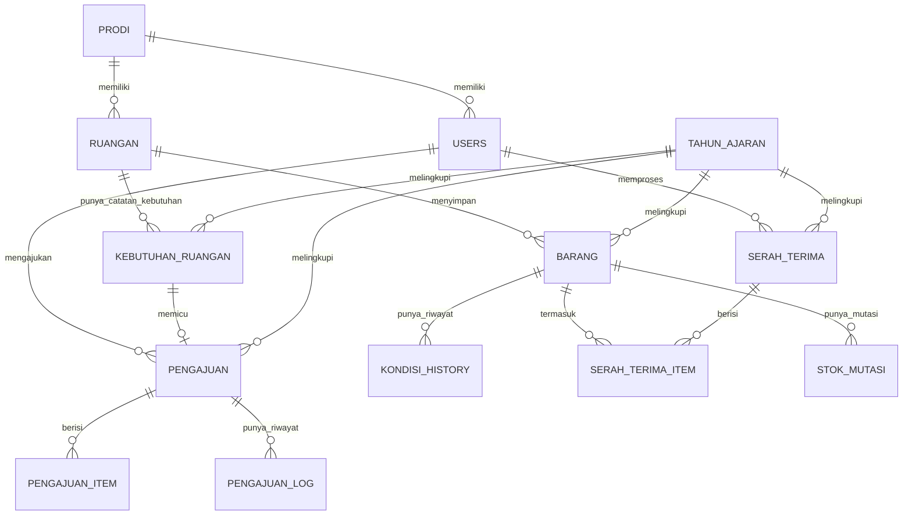

# Database Schema

> ✅ **Update**: Skema `barang` di bawah sudah disesuaikan dengan format asli Ka. TU (field: tanggal pembukuan, nama barang, keterangan nomor/ukuran, merek/type, kuantitas, nama satuan, kategori, kelengkapan dokumen, kondisi barang, harga, keterangan). Tabel lain (serah terima, pengajuan, dst) masih mengikuti struktur umum — sesuaikan lagi kalau ada format khusus lain dari sekolah.

## ERD Ringkas


## Tabel `tahun_ajaran`
| Kolom | Tipe | Keterangan |
|---|---|---|
| id | PK | |
| nama_tahun_ajaran | varchar unique | contoh `2025/2026` |
| tanggal_mulai | date | |
| tanggal_selesai | date | |
| status | enum(`aktif`,`nonaktif`), default `nonaktif` | hanya boleh **1 tahun ajaran berstatus aktif** di satu waktu — dipakai sistem sebagai default saat mencatat data baru |
| timestamps | | |

> Semua data transaksi baru (barang masuk, pengajuan, serah terima, kebutuhan ruangan) otomatis ditandai dengan `tahun_ajaran_id` yang sedang **aktif**, supaya laporan bisa difilter per tahun ajaran (lihat F6 & F10 di `05_FEATURES_SPEC.md`).

## Tabel `users`
| Kolom | Tipe | Keterangan |
|---|---|---|
| id | bigint PK | |
| name | varchar | |
| email | varchar unique | dipakai untuk login |
| password | varchar | hashed |
| role | enum(`kepsek`,`waka_sarpras`,`ka_tu`,`ka_prodi`) | |
| prodi_id | FK nullable → prodi.id | wajib diisi jika role = `ka_prodi` |
| phone | varchar nullable | |
| is_active | boolean, default true | untuk nonaktifkan akun tanpa hapus |
| timestamps | | |

## Tabel `prodi`
| Kolom | Tipe | Keterangan |
|---|---|---|
| id | PK | |
| nama_prodi | varchar | misal "Teknik Komputer Jaringan" |
| timestamps | | |

## Tabel `ruangan`
| Kolom | Tipe | Keterangan |
|---|---|---|
| id | PK | |
| nama_ruangan | varchar | misal "Lab Komputer 1", "Ruang TU" |
| prodi_id | FK nullable | ruangan bisa milik prodi tertentu, atau umum (null) |
| timestamps | | |

## Tabel `barang` (Data Barang / Aset Utama)
Field disusun mengikuti format pembukuan Ka. TU, ditambah beberapa kolom pendukung sistem (kode_barang, ruangan_id, status, relasi user).

| Kolom | Tipe | Keterangan |
|---|---|---|
| id | PK | |
| kode_barang | varchar unique | auto-generate, contoh `BOS-2026-0001` / `KOM-2026-0001` — **tambahan sistem**, untuk id unik & pencarian cepat |
| tanggal_pembukuan | date | tanggal barang dicatat/dibukukan |
| nama_barang | varchar | |
| keterangan_nomor_ukuran | text nullable | keterangan nomor, ukuran, dsb (sesuai kolom "Keterangan Nomor, Ukuran, DSB" di format Ka. TU) |
| merek_type | varchar nullable | merek/type barang |
| kuantitas | integer | jumlah barang |
| nama_satuan | varchar | pcs / unit / rim / set / dsb |
| kategori | enum(`bos`,`komite`) | sumber dana pengadaan |
| jenis_barang | enum(`inventaris`,`non_inventaris`) | **inventaris** = barang masih bisa dipakai ≥1 tahun ke depan (meja, kursi, komputer, dst); **non_inventaris** = barang habis pakai/dipakai <1 tahun (kertas, buku, ATK, dst) |
| kelengkapan_dokumen | varchar nullable | misal: nota, faktur, garansi, BAST |
| kondisi | enum(`baik`,`rusak_ringan`,`rusak_sedang`,`rusak_berat`), default `baik` | kondisi terkini (snapshot; riwayat lengkap + foto ada di `kondisi_history`) |
| harga | decimal nullable | harga perolehan/satuan |
| keterangan | text nullable | catatan umum tambahan |
| ruangan_id | FK nullable → ruangan.id | **tambahan sistem**, lokasi barang saat ini (dibutuhkan untuk fitur Data Barang per Ruangan) |
| tahun_ajaran_id | FK → tahun_ajaran.id | **tambahan sistem**, tahun ajaran saat barang dicatat/diperoleh |
| status | enum(`aktif`,`dihapuskan`), default `aktif` | **tambahan sistem**, untuk barang write-off |
| dicatat_oleh | FK → users.id | **tambahan sistem**, biasanya `ka_tu` |
| timestamps | | |

> Catatan: `kondisi` di atas memakai 4 tingkat (baik/rusak ringan/rusak sedang/rusak berat) sesuai kebutuhan awal. Kalau format resmi Ka. TU hanya pakai 3 tingkat (baik/rusak ringan/rusak berat) tanpa "rusak sedang", tinggal hapus 1 nilai enum ini — tidak mempengaruhi tabel lain.

## 📋 Data Barang per Ruangan (Report, bukan tabel tersendiri)
Format: **Nama Barang | Jumlah Total | Kondisi Baik | Kondisi Rusak Ringan | Kondisi Rusak Berat | Keterangan | Kebutuhan**

Ini dihasilkan dari **agregasi tabel `barang`**, dikelompokkan per `ruangan_id` + `nama_barang`:
```sql
SELECT ruangan_id, nama_barang,
       SUM(kuantitas) AS jumlah_tersedia,
       SUM(CASE WHEN kondisi = 'baik' THEN kuantitas ELSE 0 END) AS kondisi_baik,
       SUM(CASE WHEN kondisi = 'rusak_ringan' THEN kuantitas ELSE 0 END) AS rusak_ringan,
       SUM(CASE WHEN kondisi = 'rusak_berat' THEN kuantitas ELSE 0 END) AS rusak_berat
FROM barang
GROUP BY ruangan_id, nama_barang
```
Kolom **Keterangan** & **Kebutuhan** tidak bisa dihitung otomatis (butuh input manual dari Ka. Prodi/pengguna ruangan), makanya disimpan di tabel terpisah `kebutuhan_ruangan` lalu di-`LEFT JOIN` ke hasil agregasi di atas.

## 🔔 Logika Deteksi Kekurangan → Pemicu Permintaan
Setiap baris rekap (`ruangan_id` + `nama_barang`) membandingkan **`jumlah_tersedia`** (hasil agregasi di atas) dengan **`kebutuhan_ruangan.jumlah_dibutuhkan`** (target ideal yang diisi Ka. Prodi):

- Jika `jumlah_tersedia < jumlah_dibutuhkan` → status baris = **`kurang`**, sistem menampilkan badge "Kurang X unit" dan tombol **"Ajukan Permintaan"**
- Jika `jumlah_tersedia >= jumlah_dibutuhkan` → status = **`cukup`**, tidak ada aksi lanjutan
- Saat tombol "Ajukan Permintaan" diklik → sistem otomatis membuat draft di tabel `pengajuan` + `pengajuan_item`, terisi otomatis: nama barang, kategori, jumlah = selisih kekurangan → lanjut mengikuti **Alur Pengadaan Barang** (lihat `06_WORKFLOW_ALUR_BARANG.md`)
- Baris yang sudah punya pengajuan aktif (belum `selesai`/`ditolak`) berstatus **`sudah_diajukan`**, agar tidak dobel pengajuan untuk kebutuhan yang sama

> Catatan asumsi: "kebutuhan" di sini diartikan sebagai jumlah ideal/target yang seharusnya ada di ruangan tsb — jadi permintaan otomatis dipicu saat **stok tersedia lebih sedikit dari target kebutuhan** (kekurangan). Kalau logikanya beda dari yang dimaksud, tinggal kabari, tinggal dibalik kondisinya.

## Tabel `kebutuhan_ruangan`
| Kolom | Tipe | Keterangan |
|---|---|---|
| id | PK | |
| ruangan_id | FK → ruangan.id | |
| tahun_ajaran_id | FK → tahun_ajaran.id | kebutuhan dinilai ulang tiap tahun ajaran |
| nama_barang | varchar | nama barang yang dinilai (samakan penulisan dengan `barang.nama_barang` agar bisa di-join) |
| jumlah_dibutuhkan | integer | jumlah ideal/target yang seharusnya ada di ruangan tsb |
| keterangan | text nullable | catatan kondisi umum dari ruangan tsb |
| status | enum(`cukup`,`kurang`,`sudah_diajukan`), default `cukup` | dihitung ulang otomatis tiap kali data barang/kebutuhan berubah |
| pengajuan_id | FK nullable → pengajuan.id | terisi otomatis begitu "Ajukan Permintaan" diklik, untuk lacak balik asal pengajuan |
| dicatat_oleh | FK → users.id | biasanya `ka_prodi` |
| tanggal | date | |
| timestamps | | |

## Tabel `kondisi_history` (Riwayat Kondisi & Foto Kerusakan)
| Kolom | Tipe | Keterangan |
|---|---|---|
| id | PK | |
| barang_id | FK → barang.id | |
| kondisi | enum(`baik`,`rusak_ringan`,`rusak_sedang`,`rusak_berat`) | |
| keterangan | text nullable | |
| foto_1 | varchar | path foto arah 1 (tampak depan) — **wajib diisi jika kondisi ≠ `baik`** |
| foto_2 | varchar | path foto arah 2 (tampak samping) — wajib jika kondisi ≠ `baik` |
| foto_3 | varchar | path foto arah 3 (detail kerusakan) — wajib jika kondisi ≠ `baik` |
| dilaporkan_oleh | FK → users.id | |
| tanggal_lapor | date | |
| timestamps | | |

## Tabel `serah_terima`
| Kolom | Tipe | Keterangan |
|---|---|---|
| id | PK | |
| nomor_berita_acara | varchar unique | auto-generate |
| tahun_ajaran_id | FK → tahun_ajaran.id | |
| dari_user_id | FK → users.id | biasanya `waka_sarpras` |
| ke_user_id | FK → users.id | penerima, biasanya `ka_prodi` |
| tanggal_serah_terima | date | |
| status | enum(`draft`,`diproses`,`selesai`), default `draft` | |
| catatan | text nullable | |
| dibuat_oleh | FK → users.id | |
| timestamps | | |

## Tabel `serah_terima_item`
| Kolom | Tipe | Keterangan |
|---|---|---|
| id | PK | |
| serah_terima_id | FK → serah_terima.id | |
| barang_id | FK → barang.id | |
| jumlah | integer | |
| kondisi_saat_serah_terima | enum(`baik`,`rusak_ringan`,`rusak_sedang`,`rusak_berat`) | snapshot kondisi saat serah terima |

## Tabel `pengajuan` (Alur Pengadaan Barang)
| Kolom | Tipe | Keterangan |
|---|---|---|
| id | PK | |
| kode_pengajuan | varchar unique | |
| kategori | enum(`bos`,`komite`) | |
| tahun_ajaran_id | FK → tahun_ajaran.id | |
| sumber | enum(`manual`,`otomatis_kebutuhan_ruangan`), default `manual` | `otomatis_kebutuhan_ruangan` jika dibuat dari tombol "Ajukan Permintaan" di rekap ruangan |
| kebutuhan_ruangan_id | FK nullable → kebutuhan_ruangan.id | terisi jika `sumber = otomatis_kebutuhan_ruangan` |
| diajukan_oleh | FK → users.id | biasanya `ka_prodi`, bisa juga `waka_sarpras` |
| status | enum(`diajukan`,`diteruskan_rapbs`,`disetujui`,`dibelanjakan`,`diserahkan_waka`,`diserahkan_pengguna`,`selesai`,`ditolak`), default `diajukan` | lihat detail alur di `06_WORKFLOW_ALUR_BARANG.md` |
| catatan | text nullable | |
| timestamps | | |

## Tabel `pengajuan_item`
| Kolom | Tipe | Keterangan |
|---|---|---|
| id | PK | |
| pengajuan_id | FK → pengajuan.id | |
| nama_barang | varchar | |
| jumlah | integer | |
| satuan | varchar | |
| estimasi_harga | decimal nullable | |
| keterangan | text nullable | |
| barang_id | FK nullable → barang.id | diisi setelah barang resmi tercatat di tabel `barang` |

## Tabel `pengajuan_log` (Riwayat Status Pengajuan)
| Kolom | Tipe | Keterangan |
|---|---|---|
| id | PK | |
| pengajuan_id | FK → pengajuan.id | |
| status | varchar | status pada saat itu |
| updated_by | FK → users.id | |
| keterangan | text nullable | |
| created_at | | |

## Tabel `stok_mutasi`
| Kolom | Tipe | Keterangan |
|---|---|---|
| id | PK | |
| barang_id | FK → barang.id | |
| jenis | enum(`masuk`,`keluar`) | |
| jumlah | integer | |
| referensi_tipe | varchar nullable | `serah_terima` / `pengajuan` |
| referensi_id | bigint nullable | id record terkait |
| tanggal | date | |
| keterangan | text nullable | |

## Indexing yang Disarankan
- `barang.kode_barang` — unique index (pencarian cepat)
- `barang.kategori`, `barang.jenis_barang`, `barang.kondisi`, `barang.ruangan_id`, `barang.tahun_ajaran_id` — index untuk filter laporan & report per ruangan/tahun ajaran
- `kebutuhan_ruangan.ruangan_id`, `kebutuhan_ruangan.status` — index untuk join ke report per ruangan & filter "kurang"
- `pengajuan.status`, `pengajuan.tahun_ajaran_id` — index untuk dashboard status & laporan per tahun ajaran
- `tahun_ajaran.status` — index, hanya 1 baris boleh `aktif`
- `users.role` — index untuk query per role
