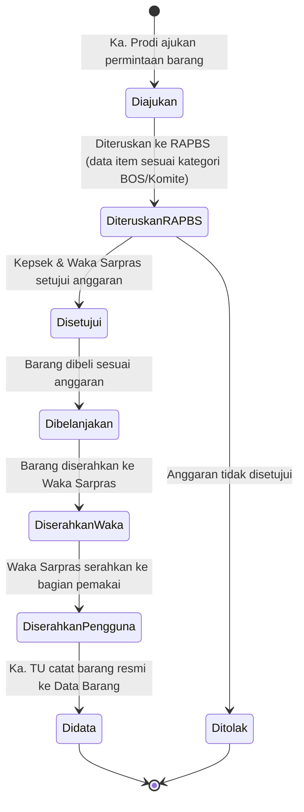
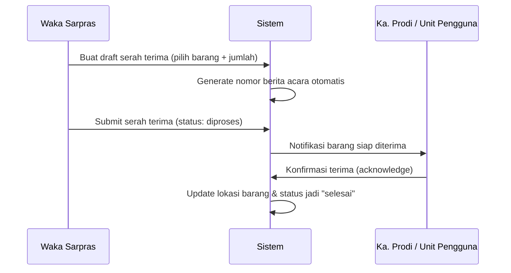
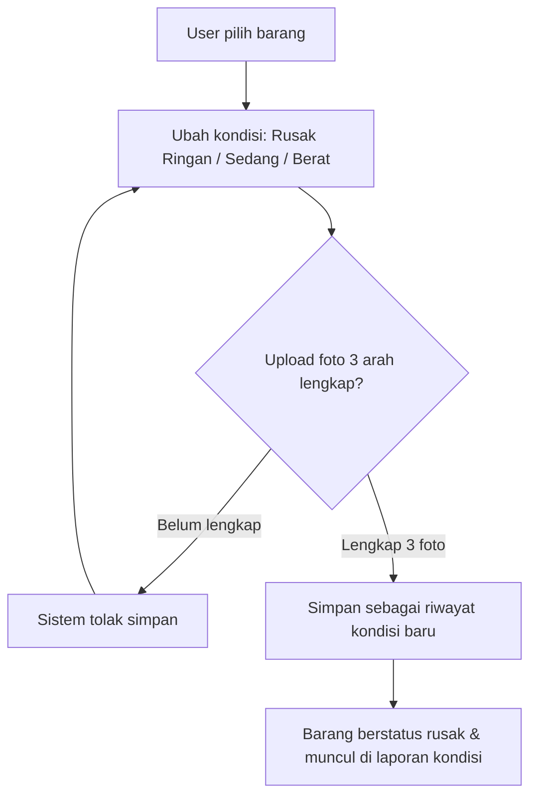
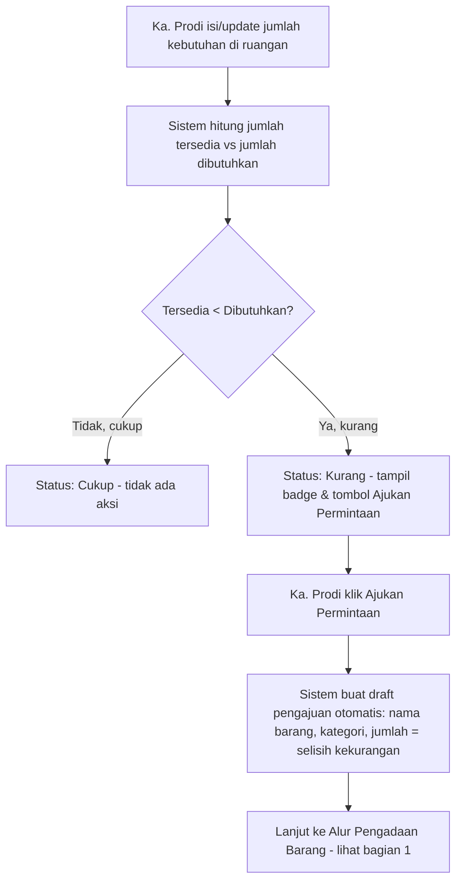

# Alur Proses Bisnis (Workflow)

## 1. Alur Pengadaan / Penambahan Barang

Sesuai kebutuhan: permintaan diajukan → Waka Sarpras/Ka. Prodi → diteruskan ke RAPBS (data item sesuai kategori) → dibelanjakan → diserahkan ke Waka Sarpras → diberikan ke bagian pengguna → didata.

**Detail tiap tahap**:
1. **Diajukan** — Ka. Prodi (atau Waka Sarpras) mengajukan kebutuhan barang: nama barang, jumlah, kategori (BOS/Komite), alasan kebutuhan
2. **Diteruskan RAPBS** — Ka. Prodi/Waka Sarpras input data ke rencana anggaran (RAPBS), dikelompokkan sesuai kategori
3. **Disetujui** — Kepsek & Waka Sarpras menyetujui anggaran
4. **Dibelanjakan** — barang dibeli (bisa lampirkan bukti nota belanja)
5. **Diserahkan ke Waka Sarpras** — barang fisik diterima & diverifikasi Waka Sarpras
6. **Diserahkan ke Pengguna** — proses ini terhubung dengan fitur **Serah Terima Barang** (lihat F2 di `05_FEATURES_SPEC.md`)
7. **Didata** — Ka. TU mencatat barang secara resmi ke tabel `barang` dengan kode barang baru

---

## 2. Alur Serah Terima Barang

---

## 3. Alur Pelaporan Kondisi Barang Rusak

---

## 4. Alur Rekap 3 Pihak

- **Ka. TU** — sumber data master (seluruh barang tercatat di sistem)
- **Ka. Prodi** — konfirmasi barang yang benar-benar ada & dipakai di prodinya masing-masing
- **Waka Sarpras** — status distribusi/serah terima barang

Sistem menampilkan **dashboard perbandingan** ketiga sumber data ini, dan menandai barang yang datanya tidak sinkron (misal: tercatat di data Ka. TU tapi belum dikonfirmasi oleh Ka. Prodi terkait) supaya bisa segera ditindaklanjuti oleh Waka Sarpras/Kepsek.

## 5. Alur Deteksi Kekurangan Barang → Permintaan Otomatis

Terhubung ke fitur Data Barang per Ruangan (F8). Setiap kali Ka. Prodi mengisi/update `jumlah_dibutuhkan` untuk suatu barang di ruangannya, sistem otomatis membandingkan dengan stok yang tersedia di ruangan itu.

**Catatan**:
- Selama pengajuan masih berjalan (belum berstatus `selesai`/`ditolak`), baris kebutuhan tsb berstatus `sudah_diajukan` agar tidak dobel pengajuan untuk kebutuhan yang sama
- Setelah pengajuan `selesai` dan barang baru tercatat di ruangan tsb, sistem otomatis menghitung ulang status (`cukup`/`kurang`) di periode berikutnya

## 6. Laporan per Tahun Ajaran

Setiap tahun ajaran (`tahun_ajaran`) punya set laporannya sendiri — data barang, kebutuhan ruangan, dan pengajuan yang dicatat dalam periode tahun ajaran tersebut otomatis ditandai `tahun_ajaran_id` yang sedang aktif. Di halaman Laporan (F6), tersedia filter dropdown "Tahun Ajaran" sehingga Kepsek/Waka Sarpras/Ka. TU bisa membandingkan laporan antar tahun (misal: laporan 2025/2026 vs 2026/2027) tanpa data tercampur.
